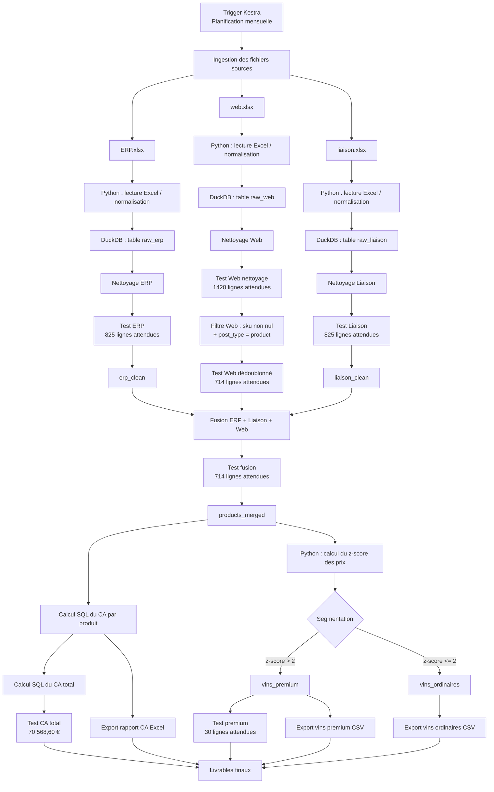

# oc_projet10 — Automatisation d’un pipeline de transformation et d’analyse avec Kestra

## 1. Contexte du projet

BottleNeck est un marchand de vin qui dispose de données issues de deux systèmes :

* un fichier ERP contenant le référentiel produit, les prix, les stocks et les statuts de stock ;
* un fichier Web issu du CMS, contenant les informations publiées en ligne et les ventes ;
* un fichier de liaison permettant de rapprocher les identifiants ERP avec les identifiants Web.

L’objectif du projet est d’automatiser une chaîne de traitement permettant de nettoyer les données, rapprocher les sources, calculer le chiffre d’affaires et identifier les vins premium à partir d’un z-score sur le prix.

Le pipeline est orchestré avec Kestra, les traitements relationnels sont exécutés avec DuckDB, et Python est utilisé pour la lecture des fichiers Excel, certains contrôles, le calcul du z-score et les exports.

## 2. Technologies utilisées

### Kestra

Kestra est utilisé comme orchestrateur de workflow. Il pilote les différentes étapes du pipeline : inspection des fichiers, chargement DuckDB, nettoyage, fusion, calculs, segmentation et export des livrables.

Dans ce projet, le flow Kestra est défini dans :

```text
flows/bottleneck_pipeline.yml
```

### DuckDB

DuckDB est utilisé comme moteur SQL analytique embarqué. Il permet de créer des tables intermédiaires, d’exécuter les requêtes de nettoyage, de faire les jointures entre sources et de calculer le chiffre d’affaires.

La base générée localement est située ici :

```text
data/output/working/bottleneck.duckdb
```

### Python

Python est utilisé pour :

* lire les fichiers Excel ;
* charger les données dans DuckDB ;
* exécuter les contrôles ;
* calculer le z-score ;
* exporter les fichiers finaux.

### uv

`uv` est utilisé pour gérer l’environnement Python, les dépendances et le fichier de verrouillage.

Les fichiers principaux sont :

```text
pyproject.toml
uv.lock
.python-version
```

Le projet est borné sur Python 3.12 afin d’éviter les incompatibilités observées avec Python 3.14 et les extensions natives de NumPy/Pandas.

## 3. Structure du dépôt

```text
oc_projet10/
├── data/
│   ├── input/
│   │   ├── Fichier_erp.xlsx
│   │   ├── Fichier_web.xlsx
│   │   └── fichier_liaison.xlsx
│   └── output/
│       ├── latest/
│       │   ├── bottleneck_revenue_report.xlsx
│       │   ├── premium_wines.csv
│       │   └── ordinary_wines.csv
│       └── working/
│           └── bottleneck.duckdb
├── flows/
│   └── bottleneck_pipeline.yml
├── scripts/
│   ├── python/
│   │   ├── 01_inspect_sources.py
│   │   ├── 02_load_staging_duckdb.py
│   │   ├── 03_clean_sources_duckdb.py
│   │   ├── 04_merge_and_compute_revenue.py
│   │   ├── 05_segment_wines_by_zscore.py
│   │   ├── 06_export_deliverables.py
│   │   └── run_pipeline.py
│   └── sql/
│       ├── 01_clean_sources.sql
│       └── 02_merge_and_revenue.sql
├── kestra/
│   └── application.yaml
├── docker-compose.yml
├── pyproject.toml
├── uv.lock
├── .python-version
└── README.md
```

## 4. Diagramme de flux



## 5. Pipeline local

Le pipeline peut être exécuté localement en une seule commande :

```bash
uv run python scripts/python/run_pipeline.py
```

Ce script supprime les anciens fichiers générés, recrée la base DuckDB, relance toutes les étapes du pipeline et exporte les livrables.

Les étapes exécutées sont :

1. inspection des fichiers sources ;
2. chargement des tables brutes dans DuckDB ;
3. nettoyage des sources ;
4. fusion ERP / liaison / Web ;
5. calcul du chiffre d’affaires ;
6. segmentation des vins par z-score ;
7. export des livrables finaux.

## 6. Flow Kestra

Le pipeline est orchestré par le flow Kestra :

```text
flows/bottleneck_pipeline.yml
```

Les tâches principales du flow sont :

```text
prepare_python_environment
clean_generated_files
inspect_sources
load_staging_duckdb
clean_sources
merge_and_compute_revenue
segment_wines_by_zscore
export_deliverables
check_outputs
```

Chaque tâche est visible dans Kestra, ce qui permet de suivre précisément l’exécution du pipeline et d’identifier rapidement l’étape en échec en cas de problème.

## 7. Contrôles qualité

Le pipeline inclut plusieurs contrôles bloquants. Si un contrôle échoue, le script concerné lève une erreur et l’exécution Kestra passe en échec.

Contrôles réalisés :

| Contrôle                                | Valeur attendue |
| --------------------------------------- | --------------: |
| ERP brut                                |      825 lignes |
| Web brut                                |     1513 lignes |
| Liaison brute                           |      825 lignes |
| ERP nettoyé                             |      825 lignes |
| Liaison nettoyée                        |      825 lignes |
| Web après suppression des SKU manquants |     1428 lignes |
| Web dédoublonné                         |      714 lignes |
| Données fusionnées                      |      714 lignes |
| Chiffre d’affaires total                |     70 568,60 € |
| Vins premium                            |       30 lignes |
| Vins ordinaires                         |      684 lignes |

Ces contrôles permettent de garantir que le traitement reste cohérent avec les résultats de référence attendus.

## 8. Livrables générés

Les livrables finaux sont générés dans :

```text
data/output/latest/
```

Fichiers produits :

| Fichier                          | Description                                                                              |
| -------------------------------- | ---------------------------------------------------------------------------------------- |
| `bottleneck_revenue_report.xlsx` | Rapport Excel contenant le chiffre d’affaires total et le chiffre d’affaires par produit |
| `premium_wines.csv`              | Liste des vins premium, définis par un z-score du prix strictement supérieur à 2         |
| `ordinary_wines.csv`             | Liste des vins ordinaires, définis par un z-score inférieur ou égal à 2                  |

## 9. Règle de segmentation premium

Le z-score est calculé sur le prix des produits fusionnés, après rapprochement entre ERP, fichier de liaison et Web.

La règle appliquée est :

```text
z-score > 2 => vin premium
z-score <= 2 => vin ordinaire
```

Le calcul est effectué après la fusion afin de ne travailler que sur les 714 produits réellement exploitables dans les données finales.

## 10. Lancer Kestra localement

Kestra est lancé avec Docker Compose :

```bash
docker compose up -d
```

L’interface est ensuite accessible sur :

```text
http://localhost:8080
```

En environnement distant, il faut accéder au port 8080 de la machine hôte ou utiliser un tunnel SSH.

## 11. Exécuter le flow dans Kestra

Dans l’interface Kestra :

1. ouvrir le namespace `openclassrooms.projet10` ;
2. ouvrir le flow `bottleneck_pipeline` ;
3. cliquer sur `Execute` ;
4. vérifier que toutes les tâches passent en succès ;
5. contrôler la présence des fichiers dans `data/output/latest/`.

## 12. Gestion des erreurs

Le pipeline peut échouer volontairement si :

* un fichier source est absent ;
* une table DuckDB attendue est absente ;
* un nombre de lignes ne correspond pas à l’attendu ;
* le chiffre d’affaires total ne correspond pas à 70 568,60 € ;
* le nombre de vins premium est différent de 30 ;
* un fichier de sortie n’est pas généré.

Dans ce cas, Kestra permet d’identifier la tâche en échec et de consulter les logs associés.

## 13. Points d’attention techniques

### Environnement Python

Le projet utilise Python 3.12. Une incompatibilité a été observée avec Python 3.14 sur les dépendances natives NumPy/Pandas. Le projet est donc explicitement borné sur Python 3.12 dans `pyproject.toml` et `.python-version`.

### Fichier Web

Le fichier Web contient des lignes de type `product`, des lignes de type `attachment` et des lignes sans SKU. Le pipeline conserve les lignes utiles en filtrant les SKU non nuls et en priorisant les lignes `post_type = product`.

### Identifiants Web

Les identifiants `sku` et `id_web` sont traités comme des chaînes de caractères, car certains identifiants ne sont pas purement numériques.

## 14. Améliorations possibles

Plusieurs améliorations pourraient être ajoutées dans un contexte de production :

* archivage horodaté des fichiers sources ;
* historisation des exports ;
* notification en cas d’échec du workflow ;
* stockage des logs dans un espace dédié ;
* séparation des environnements de développement et de production ;
* remplacement des fichiers Excel par une ingestion depuis une source applicative ou un stockage objet ;
* ajout de tests unitaires automatisés ;
* ajout d’un système de monitoring.

## 15. Résultat attendu

Lorsque le pipeline est exécuté correctement, les résultats attendus sont :

```text
Chiffre d’affaires total : 70 568,60 €
Nombre de produits fusionnés : 714
Nombre de vins premium : 30
Nombre de vins ordinaires : 684
```

Le pipeline est donc reproductible, contrôlé et orchestré par Kestra.
