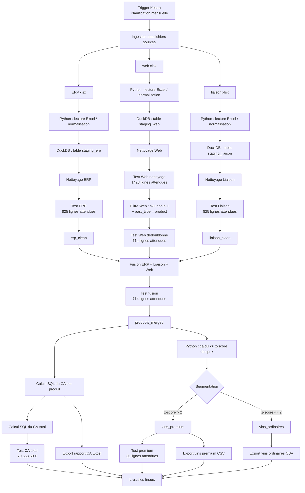

# oc_projet10

# Diagramme de flux


```mermaid
flowchart TD

    A[Trigger Kestra<br/>Planification mensuelle] --> B[Ingestion des fichiers sources]

    B --> B1[ERP.xlsx]
    B --> B2[web.xlsx]
    B --> B3[liaison.xlsx]

    B1 --> C1[Python : lecture Excel / normalisation]
    B2 --> C2[Python : lecture Excel / normalisation]
    B3 --> C3[Python : lecture Excel / normalisation]

    C1 --> D1[DuckDB : table staging_erp]
    C2 --> D2[DuckDB : table staging_web]
    C3 --> D3[DuckDB : table staging_liaison]

    D1 --> E1[Nettoyage ERP]
    D2 --> E2[Nettoyage Web]
    D3 --> E3[Nettoyage Liaison]

    E1 --> T1[Test ERP<br/>825 lignes attendues]
    E2 --> T2[Test Web nettoyage<br/>1428 lignes attendues]
    E3 --> T3[Test Liaison<br/>825 lignes attendues]

    T1 --> F1[erp_clean]
    T2 --> F2[Filtre Web : sku non nul<br/>+ post_type = product]
    T3 --> F3[liaison_clean]

    F2 --> T4[Test Web dédoublonné<br/>714 lignes attendues]

    F1 --> G[Fusion ERP + Liaison + Web]
    F3 --> G
    T4 --> G

    G --> T5[Test fusion<br/>714 lignes attendues]
    T5 --> H[products_merged]

    H --> I[Calcul SQL du CA par produit]
    I --> J[Calcul SQL du CA total]
    J --> T6[Test CA total<br/>70 568,60 €]

    H --> K[Python : calcul du z-score des prix]
    K --> L{Segmentation}
    L -->|z-score > 2| M[vins_premium]
    L -->|z-score <= 2| N[vins_ordinaires]

    M --> T7[Test premium<br/>30 lignes attendues]

    I --> O[Export rapport CA Excel]
    M --> P[Export vins premium CSV]
    N --> Q[Export vins ordinaires CSV]

    O --> R[Livrables finaux]
    P --> R
    Q --> R
    T6 --> R
    T7 --> R
```

# Local Pipepline run
```
uv run python scripts/python/run_pipeline.py
```
